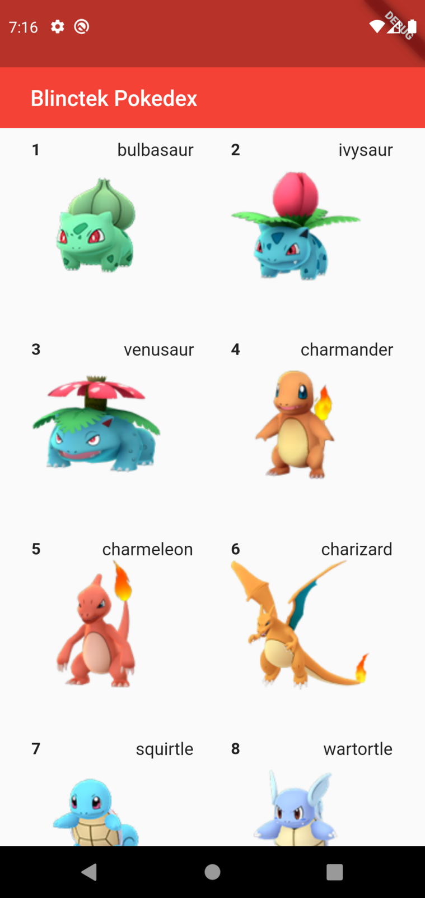

# Pokedex - BlincTek Academy

Projeto desenvolvido para o desafio da Blinctek Academy utilizando framework Flutter.

## Como executar o projeto

- Ter o [Flutter](https://flutter.dev/docs/get-started/install) instalado na sua máquina
- Ter algum editor de códigos ou IDE como o [Android Studio](https://developer.android.com/studio) ou [Intellij Idea](https://www.jetbrains.com/pt-br/idea/download/). 

Caso opte por IDEs como as duas sugeridas acima, o processo de execução do aplicativo funcionará através de um botão de play na parte superior que ambas dispõem. Caso escolha rodar o projeto via linha de comandos, utilize o comando `flutter run`. Lembre-se de antes de executar o comando de navegar até a pasta do projeto antes. 

## Comentários Finais

- Resolvi desenvolver o projeto no framework flutter já que o foco do treinamento será nele. Tive vários desafios na criação por está lidando com uma nova tecnologia que tinha somente conhecimento prévio. Desse modo, foi realmente um bom desafio para mim desenvolver este projeto e que consequentemente me rendeu ótimos aprendizados. Enfim, com
a ajuda de alguns vídeos no YouTube e também pesquisas no Google consegui idealizar alternativas para solucionar os erros e dúvidas que tive no caminho.

- A aplicação contém algumas opções incompletas que irei adicionar em breve. Devido o prazo de entrega não consegui finalizar todas as solicitações a tempo.

# Screenshots

